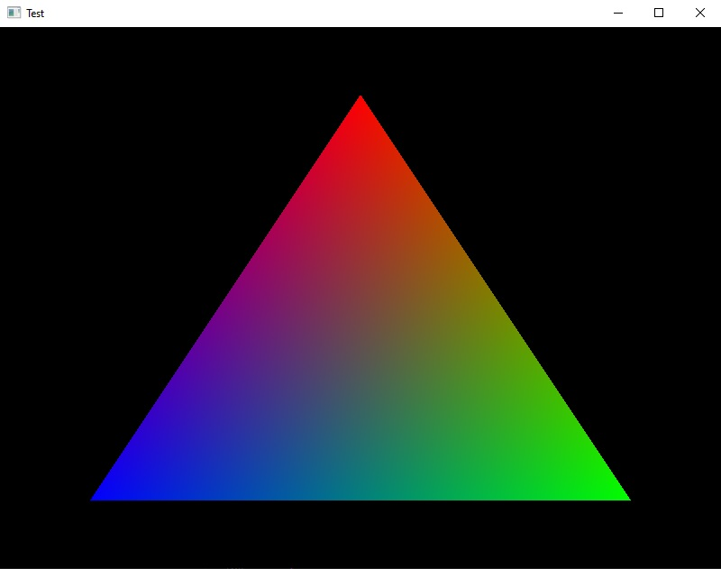

# tbaricault/glfwwrapper

[](LICENSE)


## Description

This is a C++23 wrapper library around GLFW. It's provides wrappers classes to manipulate windows, monitors, and devices.

## Table of Contents

- [Description](#description)
- [Features](#features)
- [Requirements](#requirements)
- [Usage](#usage)
    - [Download and install](#download-and-install)
    - [Uninstall](#uninstall)
    - [CMake](#cmake)
    - [Include](#include)
    - [Environment](#environment)
- [Documentation](#documentation)
- [Examples](#examples)
    - [Simple window](#simple-window)
- [License](#license)

## Features

- Window wrapper class
- Monitor wrapper class
- Clipboard class
- Device utilities

## Requirements

- C++23 or later
- CMake 3.20 or later
- [nigels-com/glew](https://github.com/nigels-com/glew)
- [glfw/glfw](https://github.com/glfw/glfw)
- [tbaricault/images](https://github.com/Thomas-Baricault/tbaricault_images)
- [tbaricault/math](https://github.com/Thomas-Baricault/tbaricault_math)

## Usage

### Download and install

```bash
git clone https://github.com/Thomas-Baricault/tbaricault_glfwwrapper.git
cd tbaricault_glfwwrapper
make install
```

### Uninstall

```bash
make uninstall
```

### CMake

Add the library to your project:

```cmake
find_package(tbaricault_glfwwrapper REQUIRED)

target_link_libraries(
    my_target
    PRIVATE
        tbaricault::glfwwrapper
)
```

### Include

```cpp
#include <tbaricault/glfwwrapper.hpp>
```

### Environment

If you have a custom C++ installation, you can edit the `ENV` variable in the `Makefile` to specify your environment path.

Example on Windows with MSYS2/MinGW64:

```makefile
ENV = C:/msys64/mingw64
```

## Documentation

Read the complete documentation at [https://docs.thomas-baricault.fr/glfwwrapper](https://docs.thomas-baricault.fr/glfwwrapper).

## Examples

### Simple window

```cpp
#include <tbaricault/glfwwrapper.hpp>


class Window
    : public tbaricault::glfwwrapper::Window
{

    public:

        using tbaricault::glfwwrapper::Window::Window;


        virtual bool render() override
        {
            tbaricault::glfwwrapper::Window::render();

            glBegin(GL_TRIANGLES);
            glColor4f(1, 0, 0, 1);
            glVertex2f(0, 0.75);
            glColor4f(0, 1, 0, 1);
            glVertex2f(0.75, -0.75);
            glColor4f(0, 0, 1, 1);
            glVertex2f(-0.75, -0.75);
            glEnd();

            return (true);
        }

};


int main()
{
    tbaricault::glfwwrapper::init();

    Window w("Test");
    while (w)
    {
        tbaricault::glfwwrapper::pollEvents();
        w.update();
    }

    tbaricault::glfwwrapper::cleanup();

    return (0);
}
```

Output:



## Roadmap

- Thread safety

## License

This project is licensed under the MIT License.

See [LICENSE](LICENSE) for details.
